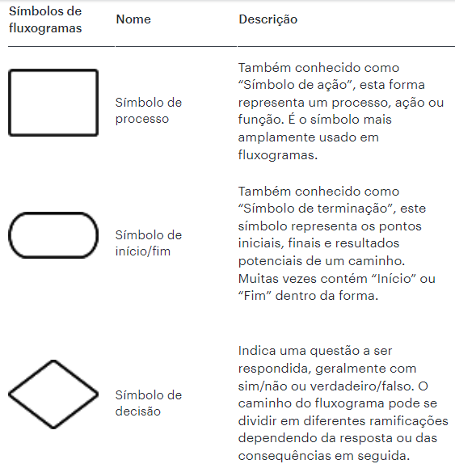
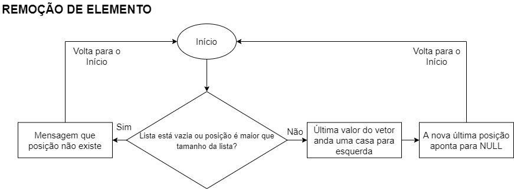
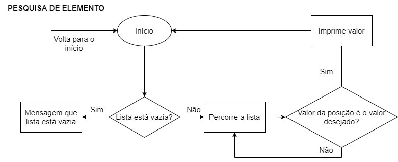

# Exercicios-de-Lista-Ativ1

<h2>Problema</h2>

Faça um diagrama para representar uma inserção, remoção e pesquisa em uma lista linear.

<h3>Resolução</h3>

A resolução deste exercício se deu por meio de três fluxogramas representando cada função pedida no enunciado respectivamente. Os fluxogramas foram construídos por meio do website https://www.diagrams.net/.

<h3>Estrutura básica de um Fluxograma</h3>

<h3>Inserção</h3>

O fluxograma para inserir um elemento consiste basicamente em um "Início" representado por um símbolo de terminação indicando o começo do programa. Em seguida passa por um símbolo de decisão retratado por um losango. Caso a lista esteja cheia o programa volta para o início, caso não esteja cheia o algoritmo passa por símbolos de ação onde o programa insere o elemento no final da lista e a última posição avança uma casa. Logo em seguida ele volta também para o início.

<h3>Remoção</h3>

O fluxograma para remover um elemento fundamenta-se basicamente em um "Início" como no fluxograma para inserção de um elemento. Em seguida passa por um símbolo de decisão. Caso a lista esteja vazia ou a posição seja maior que a lista o programa volta ao início, caso não esteja o último valor do vetor anda uma casa para a esquerda e a última nova posição aponta para NULL. Logo em seguida ele volta também para o início.

<h3>Pesquisa</h3>

O fluxograma para pesquisar um elemento baseia-se em um "Início" como no fluxograma para inserção e remoção de um elemento. Em seguida passa por um símbolo de decisão. Caso a lista esteja vazia, o programa imprime uma mensagem e volta ao início, caso não esteja, o programa percorre a lista em busca do valor desejado. Caso não encontrar numa determinada posição o valor desejado ele retorna para o laço para continuar a busca na lista. Caso encontrar, ele imprime o valor e volta ao início.
