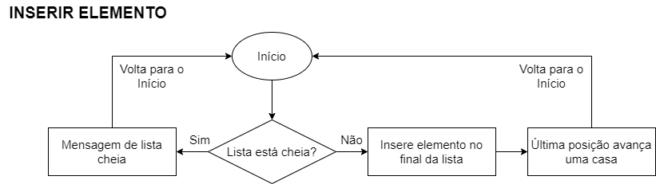

# Exercicios-de-Lista-Ativ1

<h2>Exercício 1</h2>

Faça um diagrama para representar uma inserção, remoção e pesquisa em uma lista linear.

<h3>Resolução</h3>

A resolução deste exercício se deu por meio de três fluxogramas representando cada função pedida no enunciado respectivamente. Os fluxogramas foram construídos por meio do website https://www.diagrams.net/.

<h3>Estrutura de um Fluxograma</h3>

<h3>Inserção</h3>

<h3>Remoção</h3>

<h3>Pesquisa</h3>

